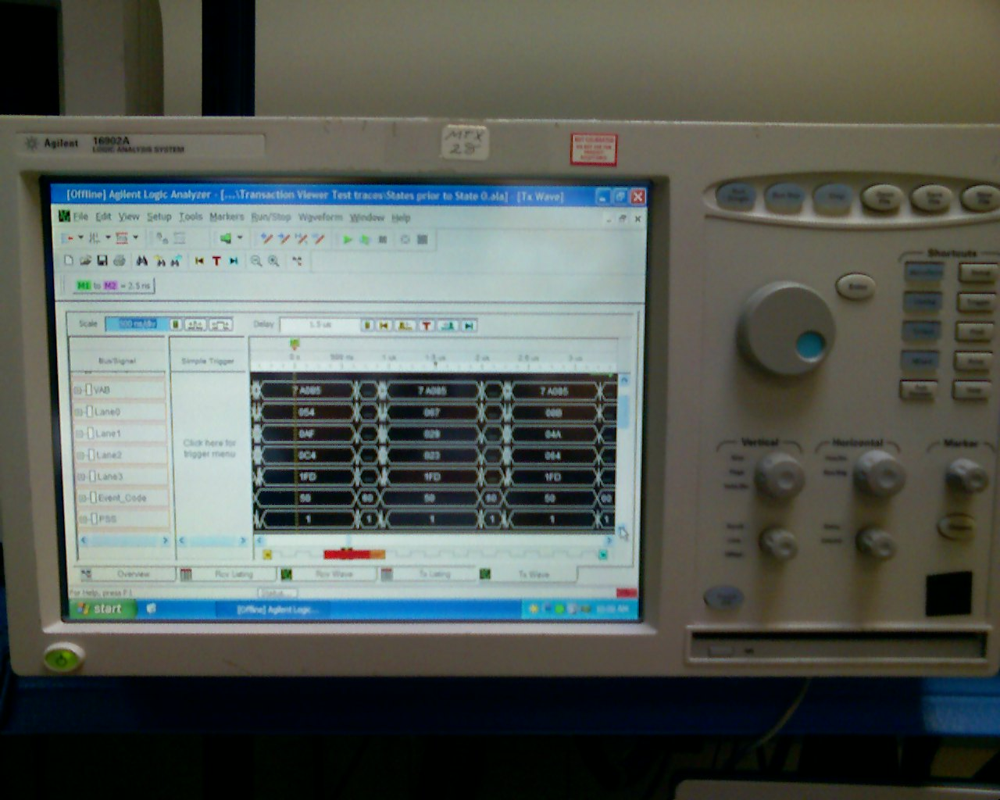
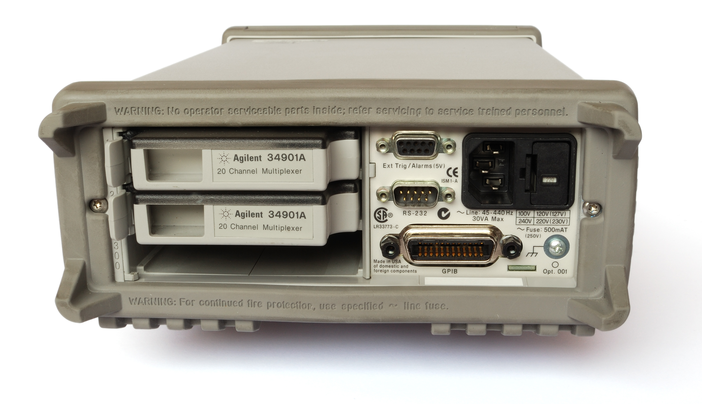
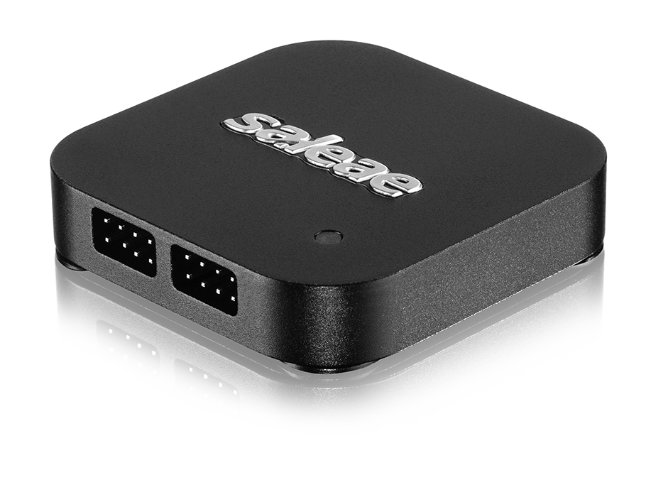

# Choosing a Logic Analyzer

If you are in the market for a logic analyzer, how do you know which one is right for you? There are many options to choose from, and looking at the various technical specifications can be intimidating. This article will give you some potential features to think about when considering your purchase.

### Form Factor

The first important decision to make is what kind of logic analyzer do you want? They come in three different forms: portable, modular, and PC-based. Each form factor has its own set of advantages and disadvantages worth considering.

#### Portable

Portable logic analyzer are generally large boxes intended to sit on a workbench. Similar to an oscilloscope, they usually have a screen and a number of knobs and buttons to navigate the various menus. Many modern portable analyzers are simply cases wrapped around a computer that runs an operating system, such as Windows.

While some can have relatively large viewing areas, they often pale in comparison to the size and real estate you might get from a traditional desktop computer monitor. Staring at a small screen for long periods of time can be painful.

The name "portable" comes from the fact that the logic analyzer components are completely self-contained. Many have large handles that allow you to move the units, should the need arise. However, some are quite large and can weigh over 30 pounds, which can make it difficult to physically move such equipment.

Despite their bulkiness, portable logic analyzers can contain specialized hardware that allow you to measure signals at higher frequencies. As they do not require a separate computer, you are not limited by connection speeds, such as USB and Ethernet.

#### Modular

Modular logic analyzers can be rack-mounted or cards that slide into a backplane. You can swap out various modular units to create a unique test equipment setup for your specific needs.

Most often, modular analyzers require computer software to control collection and analyze data. Having a separate computer gives you a potentially larger screen and an easier path to upgrade the software. However, you are limited by the connection speeds \(for example, USB or Ethernet\) between the test equipment and computer.

While the individual modules might be small \(able to fit in the palm of your hand\), they cannot work without the proper backplane. These backplanes can be anywhere from the size of a shoe box to a small room.

#### PC-Based

PC-based logic analyzers are similar to modular analyzers in that they require host computers to control the capture parameters and display waveforms. However, they do not require a backplane to operate. 

Because of the reliance on a host computer for command and control, PC-based analyzers are limited by their connection speed. Be aware of the type of connection available. For example, USB 3.0 offers higher data rates than USB 2.0.

However, because you need a computer to operate such a logic analyzer, the software is easy to upgrade, and you have the option of using one or more larger screens to help you debug. Additionally, when paired with a laptop, small PC-based analyzers can be extremely portable, which can be advantageous if you are debugging a circuit in a car or at a conference.

### Technical Specifications

As you shop for logic analyzers, you will come across a plethora of technical specifications. It can be helpful to think about what kinds of circuits you wish to debug before looking at the various specs. For example, are you working with low speed protocols, such as UART and I2C? Do you require dozens of channels to characterize a complicated FPGA circuit? Or are you trying to debug high speed signals like Ethernet and HDMI?

In this section, we'll go over some of the important specifications that you might find. Note that portable-type logic analyzers will generally have the best specifications at the cost of portability and ease-of-use.

#### Channel Count

The most apparent specification is the number of channels available on the logic analyzer.

Easy to come by, cheap.

How many do you need? Protocols vs state analysis 

#### Sample Rate

#### Bandwidth

#### Voltage

#### Input Impedance

pull-down resistance

capacitance

### Other Features to Consider

Triggering

Protocol analyzers

analog input

over voltage protection \(buffers\)

differential signals

output capability

ease of use

support

### Conclusion

