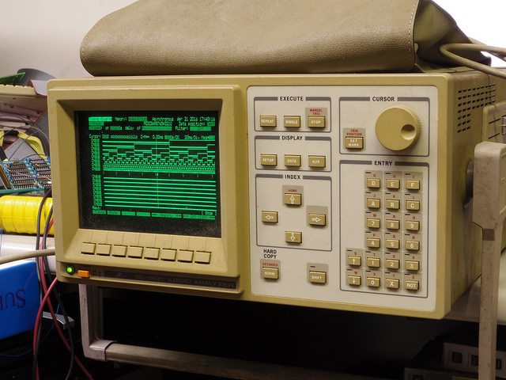
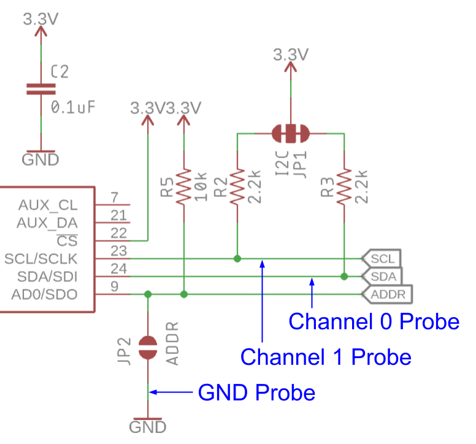
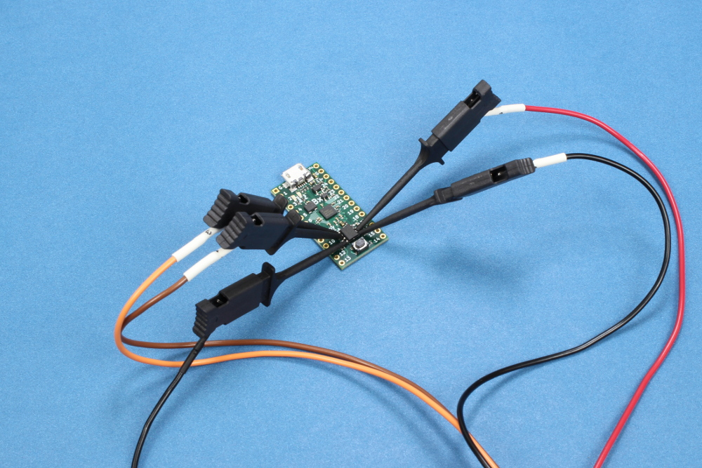
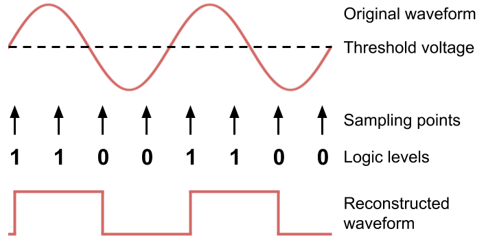
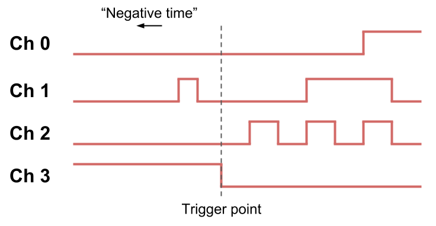
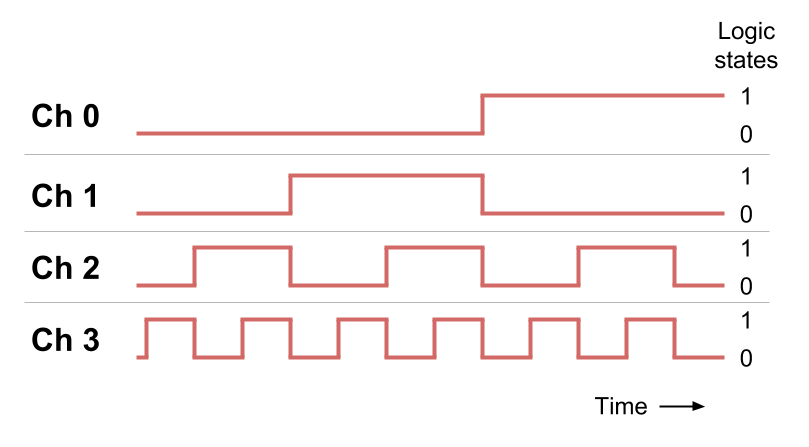
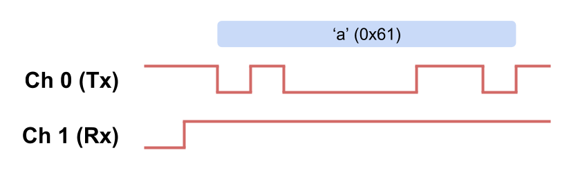

# How to Use a Logic Analyzer

## How to Use a Logic Analyzer

A logic analyzer can help you visualize the transmission of data across data lines. It does this by converting the recorded voltages over time into a series of binary data \(1s and 0s\). At first glance, a logic analyzer might be intimidating to use, but this guide can help you. We will define a few key terms and give examples of decisions you must make at each step to help you analyze your system.

In the rest of this tutorial, we will look at the five main steps normally taken to capture and analyze data using a logic analyzer:

1. Connect probes to the system under test
2. Set your sampling mode
3. Configure the trigger conditions
4. Acquire signal data
5. Display and analyze waveforms

### Terminology

A few definitions might help you on your journey with logic analyzers:

**Channel:** A single signal line on the system under test. Logic analyzers are capable of monitoring anywhere from 4 to over 100 channels at the same time.

**Threshold:** A voltage level set by the logic analyzer or by the user. Voltages detected by the probe below the threshold are assigned a logic "0," and voltages above the threshold are assigned a logic "1."

**Sample:** A single data point that is captured by the logic analyzer at a particular moment in time. The logic analyzer simultaneously compares the voltages detected on all probes to the threshold, translates them to logic 1s and 0s, and stores that data in memory.

**Sample Rate:** How fast the logic analyzer records samples within a given time period. The maximum sample rate for a logic analyzer is often given in the units of megahertz \(MHz\) or mega-samples per second \(Msps\); in both cases, a single unit \(1MHz or 1Msps\) equates to recording one million consecutive samples per second.

**Memory Depth:** The amount of memory available to store the samples. The maximum memory depth for most logic analyzers is often presented as the number of samples which can be stored per channel.

**Trigger:** The condition\(s\) necessary that cause the logic analyzer to begin sampling and recording data. For example, a rising or falling voltage on a particular channel or a particular pattern of 1s and 0s across multiple channels can be used as triggers.

### Typical Controls

Logic analyzers often have a set of buttons and knobs that allow you to configure the capture parameters or navigate through the display as shown in the figure below. PC-based logic analyzers are normally controlled through virtual "knobs" located in the user interface of software on your computer.

Most logic analyzers will have a way to set your sampling mode, sampling rate, and triggers through a set of onscreen menus. Triggers and patterns can be set or searched using a numerical keypad, often with hexadecimal \(0-9, a-f\) inputs, or with a full keyboard.

You can tell the logic analyzer to begin recording data with one of the "Execute" buttons. In the image above, the "Repeat" button will tell the analyzer to continue capturing whereas the "Single" button will only capture data until the memory is full. You can stop capturing with the "Stop" button.

Once data has been captured, you can navigate through it and search for patterns. Arrow keys or a cursor knob will let you scroll through the data or zoom in on certain parts.

### Probe Setup

Most logic analyzers come with a special wire harness that contains a number of probes, also known as "flying lead probes." To begin, connect the wire harness to the logic analyzer.

Next, ensure that the system or device you wish to test is powered off! We don't want to accidentally short something out in our circuit with a probe. Find the "ground" or "common" probe and attach it to the ground or common in your system. Ground will be used as a reference voltage when sampling signal lines. 

Note that for some logic analyzers, you will only need to attach one ground probe for the whole wire harness. With other analyzers, you will need to attach one ground probe for each signal probe. Please refer to your logic analyzer's user manual to understand its grounding requirements.

Finally, find the signal lines in your circuit that you wish to monitor. These could be GPIO lines or a communication bus, such as UART, SPI, or I2C. Attach one probe to each signal line. The logic analyzer will measure the difference between the reference voltage and signal voltage on each line.

Most logic analyzers have clip-on probes that you can attach to headers, plated-through hole \(PTH\) parts, or even some larger surface-mount devices \(SMD\). If you are working with small SMD parts with no exposed leads, you can solder thin wire to an exposed printed circuit board \(PCB\) trace to give you access to the signal.

Some high-density or high-speed systems may require a specialized connector to reduce losses and radiated noise. Test PCBs can be made with these connectors, which mate to a wire harness connector from the logic analyzer. During development, this technique can save time from having to wire up dozens of probes to the circuit. 

### Sampling Modes

Most logic analyzers have two methods of capturing and displaying data: timing mode and state mode. Timing mode is useful to view data as a waveform that changes over time whereas state mode allows you to visualize data as a list synchronized to a clock. State mode can be helpful to view data in the same manner a receiver on a transmission bus might see it.

In timing mode, also known as "asynchronous mode," data is captured at precise intervals according to the logic analyzer's internal clock. The sample rate can often be set by the user. For example, if you set the sample rate to 1 khz, the logic analyzer will capture data 1000 times per second \(in other words, sample the probed lines once every millisecond\).

In the image below, we can see how a single logic analyzer channel will sample a sine wave at precise intervals. The voltage at each sample is compared to the threshold. A digital signal is reconstructed from the captured 1s and 0s to show a waveform to the user.

State mode, also called "synchronous mode," requires one of the channels to be defined as a clock. Signals on the other data lines are sampled on the edge\(s\) of the clock signal. If a transmission bus relies on a clock line, this can be a useful way to visualize data in the same way your receiver sees it.

In the example below, we have two D flip-flops. Each has a "data in" line \(labeled D0 or D1\), a "data out" line \(labeled Q0 or Q1\), and a clock line \(clk\). On each rising edge of the clock signal, the logic level at the "data in" pin is latched and replicated on the "data out" pin.

If we attach 2 logic analyzer probes to the "data in" pins \(D0-D1\) and a third probe to the clk line, we can use state mode to see what the data should look like at the outputs \(Q0-Q1\). Note that state mode data is often presented in list format. If we are unable to probe the outputs \(e.g. they are inside an IC\), this method can help us see what is happening inside the system.

### Configure Trigger

Before you begin sampling, you will need to configure your trigger conditions. There are a few options worth considering to help you capture the data you need. 

**No trigger:** With no trigger, the logic analyzer will begin sampling and recording data as soon as you press the "Start" or "Run" button.

**Edge Trigger:** You can set the logic analyzer to watch for a rising or falling edge on a single channel, which will begin the recording process.

**Pattern Trigger:** If you are capturing multiple channels, you can set the logic analyzer to start the capturing process when it sees a pattern of 1s and 0s across several channels. Pattern triggers can be useful if you are looking for start-of-frame transmissions on parallel buses.

**Complex Trigger:** Some advanced logic analyzers will let you set a series of if-then-else statements to create a trigger. These types of triggers can be helpful to look for transmissions to a particular address on a bus, for example.

Most logic analyzers will let you configure a trigger by selecting a channel with the onscreen menu and selecting from a number options, including rising edge, falling edge, pulse width, etc. A pattern trigger can be set by selecting multiple channels and setting channel state options, such as logic high or logic low.

### Acquire

For most logic analyzers, you push a button named "Start" or "Run." With no trigger set, the analyzer will begin sampling and storing data until memory is full.

On the other hand, if you configured a trigger, the analyzer will begin capturing data, but older samples will be thrown out to make room for new samples. When the trigger condition is met, the logic analyzer will continue capturing data until its memory is full. Some logic analyzers retain and display a portion of the data prior to the trigger point. Information shown before the trigger is known as "negative time."

Some analyzers have a "repeat" or "continuous" capture mode that will continually capture and display data in real-time without stopping. This mode can be helpful for looking for signals that you might not know exist yet.

### Display and Analyze

Most logic analyzers will display data as waveforms with time in the x-axis and logic state \(1 or 0\) in the y-axis. This type of display is useful for seeing correlation among multiple signals in the time domain.

Some logic analyzers come with the ability to decode various communication protocols, such as UART, SPI, I2C, etc. Decoders might show the data as a waveform but will also present the data as decimal, hexadecimal, ASCII, and so on. Decoding protocols can be extremely helpful in troubleshooting problems on communication buses.

Advanced logic analyzers can even be equipped with decoders capable of analyzing machine language and converting it to assembly code. This type of analysis requires software unique to each type of processor or instruction set.

To view the captured data in greater detail, most logic analyzers will let you scroll or zoom using buttons or knobs. Many analyzers will also let you search for patterns by entering numbers or ASCII characters. Setting decoders usually involves selecting from an available list in one of the analyzer's menus.

A logic analyzer is a powerful tool for analyzing digital systems, and understanding the different modes and triggers can help you capture data in the right way. 

