# Logic Analyzer Tutorial: Probe Setup

Capturing a clean signal with your logic analyzer is crucial to debugging your digital circuit. If you miss logic levels due to a poor probe setup, you might spend hours trying to find a bug that doesn't exist--the problem was in your test equipment all along! Or you might introduce a large enough load to your circuit that your system stops working altogether.

Selecting the proper probe and connecting it to your circuit correctly becomes increasingly important at higher frequencies. When you start working with circuits over about 100 MHz, you need to consider grounding, probe impedance, and probe location.

In this tutorial, we will look at different probe options, various ways to connect them to your circuit, and some tips to consider when probing high speed circuits.

### Types of Probes

Most logic analyzer probes can be organized into two categories: built-in and after the fact.

#### Built-in Probes

If you are designing a printed circuit board \(PCB\) for the purposes of prototyping, you may consider adding a special footprint for hooking up a logic analyzer connector. 

By adding a spot for a logic analyzer connector, you can save yourself lots of time by not having to connect dozens of flying lead probes to individual pins on your board. On the down side, you will likely need to remove the connector footprint from the final design of your product.

One built-in option is to use a specialized connector that mates to a connector on the analyzer. This requires soldering a component to your board for the express purpose of debugging.

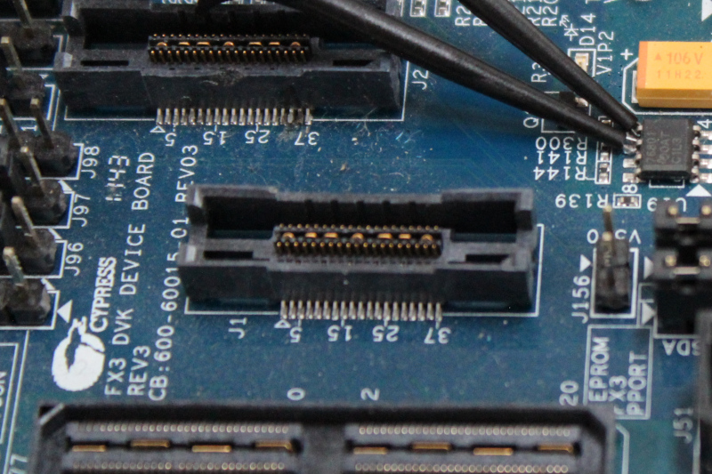

Another option is to create a series of test points with mounting holes in a particular pattern. A compression-type connector will clip to the holes and have leads that touch the test points. This method does not require a separate component soldered to the board, but it still requires board space for the footprint.

#### After the Fact Probing

If you are debugging a PCB that does not have a built-in logic analyzer connector, you can use "flying lead" probes. These probes are simply wires that you connect to the circuit in any configuration. Often, you will find flying lead probes with attachment heads that have a hook or grabber that allows you to connect to a variety of wires, pins, and test points.

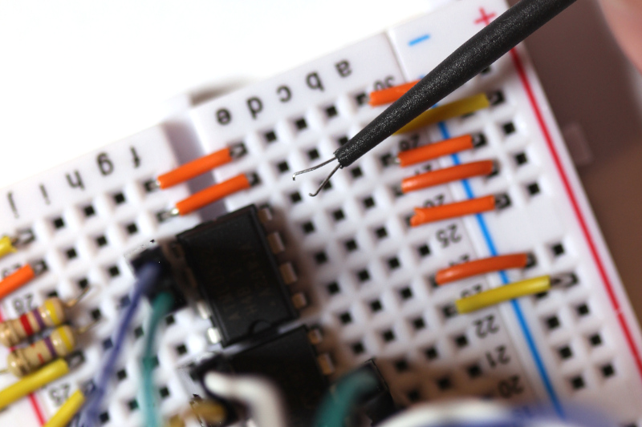

### Probing Methods

If you did not build a specialized logic analyzer connector into your PCB, finding a good spot to connect a probe might be tricky. Here are a few ideas to help you:

#### Directly to Header

Some flying lead probes are terminated with a 0.100-inch female or male header pin. In these cases, you can simply connect directly to an opposite connector on your board.

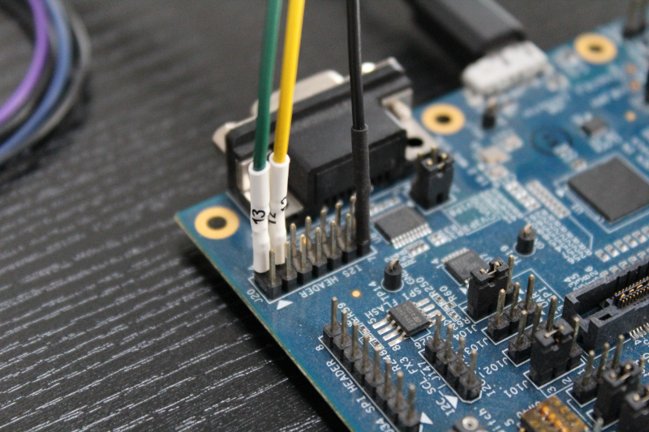

#### Clip to Exposed Wire, Pin, or Header

Many flying lead probes have heads with hooks or grabbers that let you connect to any exposed conductor. For example, you can attach these clips to male headers on the board or to wire ends.

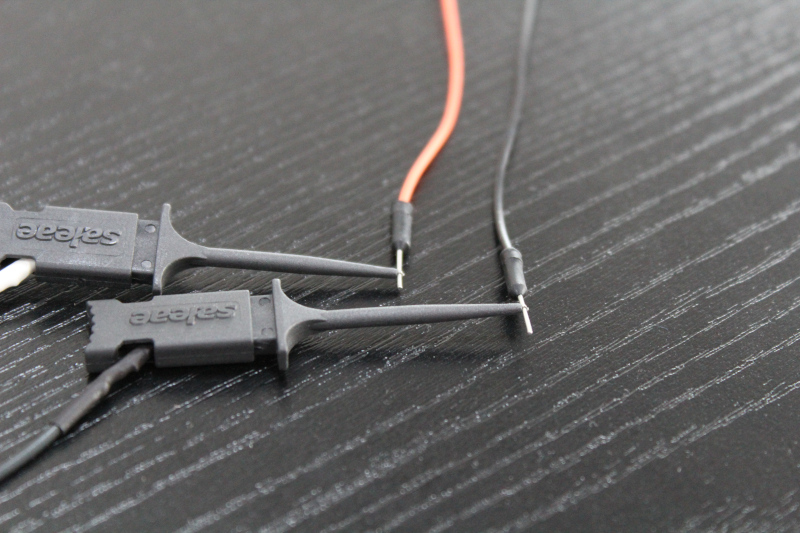

Some electrical components have leads large enough to grab with these probes. Many plated through-hole \(PTH\) parts and some surface mount devices \(SMD\) have leads with enough spacing to attach to. Examples include dual in-line packages \(DIP\) and small outline integrated circuit \(SOIC\) packages.

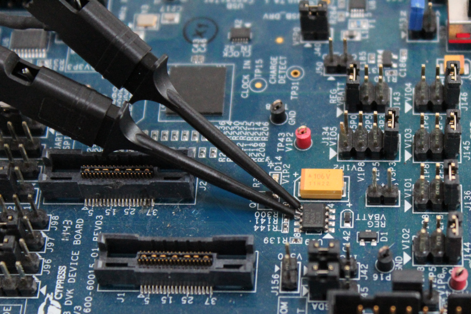

#### Clip to Test Point

Some boards have built-in test points for attaching oscilloscope or logic analyzer probes. They do not need to be populated until you need to test, and they make connecting to a node much easier.

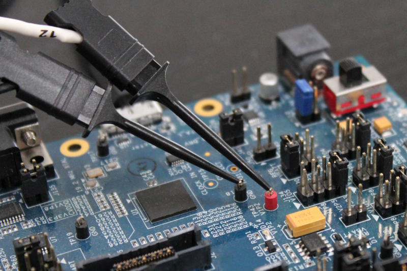

#### Solder Wire to Test Point, Pin, or Trace

Sometimes, you do not have an exposed wire or lead that you can connect to. In these cases, you will need to add a wire so that you can connect an analyzer probe. Unlike the test point components shown above, some boards have exposed pads for touching with test bed leads. You can solder a wire directly to these test points if you need to probe them.

Some fine-pitch SMD components are too small to grab with probes, but you can still solder 30 AWG wires to the leads.

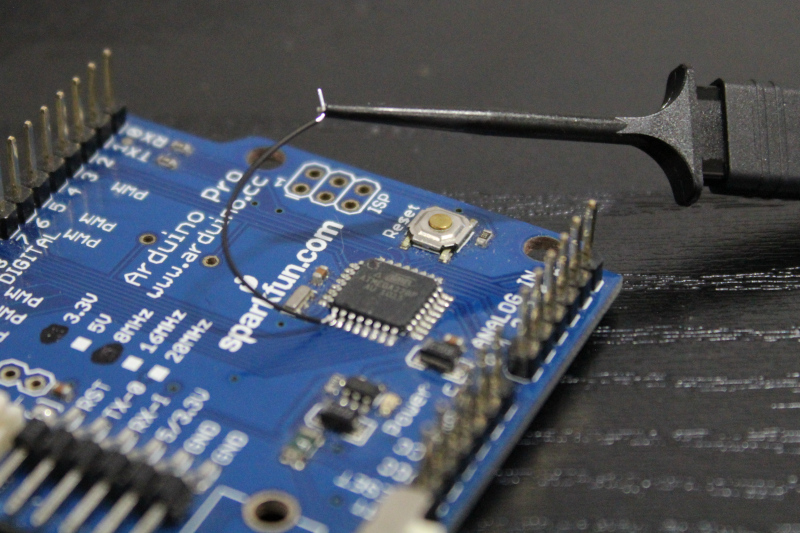

If no test points or exposed leads are available, you can scrape away solder mask to manually expose a trace and solder a thin wire to it.

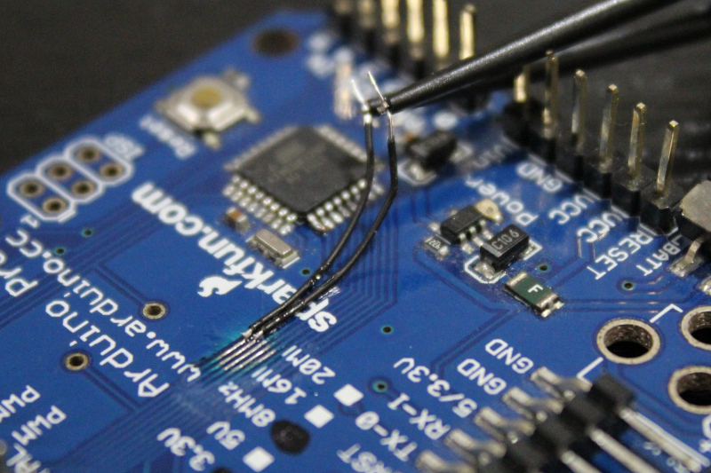

### Troubleshooting

If you are experiencing problems capturing a good signal, we recommend using this section as a checklist to ensure you are using good probing techniques.

#### Decrease Probe Loading

Whenever you attach a probe to a circuit, you are adding a load to that node \(even if it is a very small load\). Probe resistance, capacitance, and inductance make up the impedance of the probe, and at high frequencies, this impedance can pose problems. Some systems may not work under such loading, or you might get inaccurate readings.

Large surface areas on connectors can form capacitors, and long wires can add inductance. As a rule, you should use the shortest wires possible for your probes and use the smallest surface area possible to make contact with your circuit.

If are still having problems with loading, you might need to look into purchasing better probes that offer less impedance.

#### Probe the Correct Location

If you are probing cables or long stretches of traces, you might be working with transmission lines. Transmission lines do not behave like theoretical wires in that they suffer from reflections, cross-talk, and interference.

As a result, if you probe in the middle of transmission wire with improper termination, you might pick up some of these reflections. On an oscilloscope, these reflections look like stair-steps. Your logic analyzer would have a hard time interpreting a voltage near its threshold, so you may get a false reading.

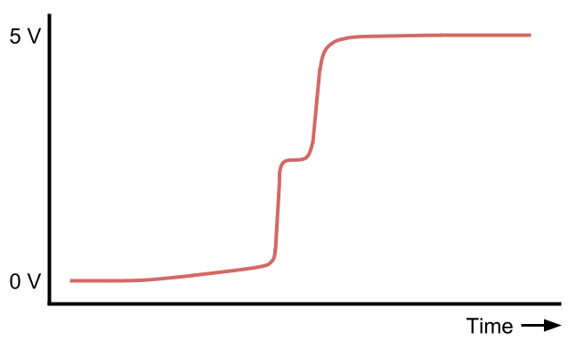

Try probing closer to your receiver to understand what the signal looks like from the receiver's perspective.

#### Watch for Ground Loops

Ground loops occur when you have two points of a circuit that are supposed to be at the same reference potential but have a voltage difference between them. This can happen if you have multiple return paths in your circuit back to a common point.

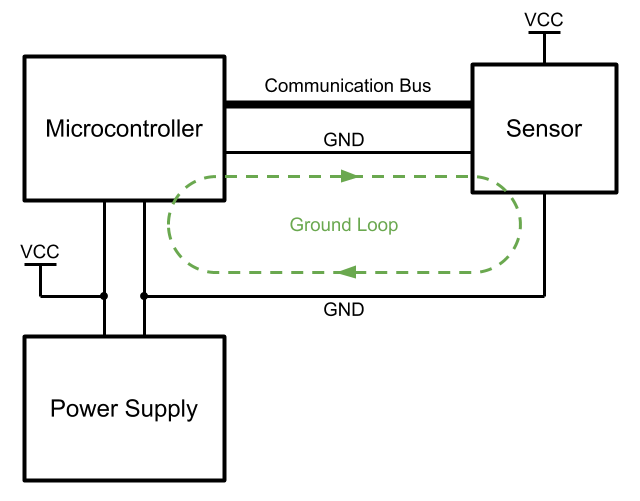

These loops act like inductors, and at high frequencies, they start to impede the changing of current. As a result, you will see a decrease in your system bandwidth.

#### Use Multiple Ground Leads

At low frequencies and low channel counts \(e.g. 8 or 16 channels\), you can use one ground probe when connecting to your system. However, as frequencies and channel count increase, more current is returned through that one ground probe, and the self-inductance of the wire starts to impede the faster switching.

As a result, a voltage will develop across the ground wire, which can degrade your measurement quality. Therefore, we recommend using a ground wire for each signal wire when working with higher frequencies.

#### Avoid T-Junctions in Transmission Lines

On transmission lines, especially at high frequencies, attaching a wire that is not properly terminated can introduce reflections in the line and degrade signal integrity. 

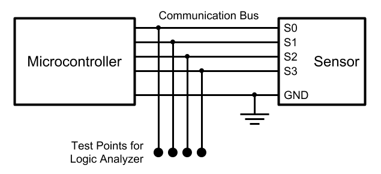

To combat reflections, avoid branching PCB traces that go to separate logic analyzer test points. Instead, consider placing the test points as close to the transmission lines as possible. If your logic analyzer uses flying lead probes, you may want to invest in specially terminated probes that attenuate signals or reduce loading.

### Conclusion

Using proper probing techniques can save you hours of headaches trying to track down false negatives. If you are using flying lead probes or tacking wires to leads, consider keeping wires as short as possible. Not only does this help with signal integrity, it can assist in keeping your work area neat when trying to figure out which wire goes where.

