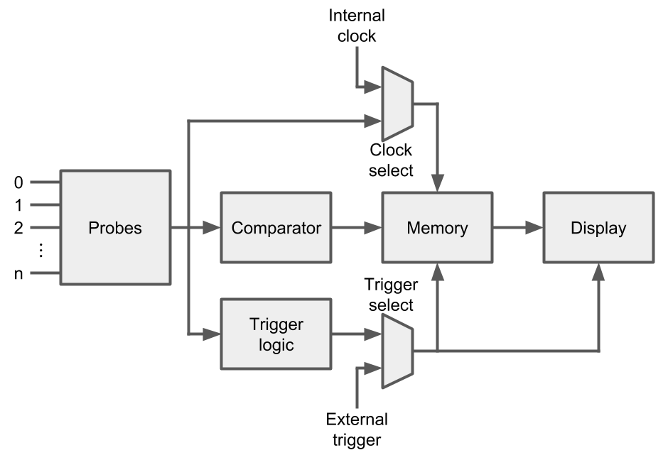
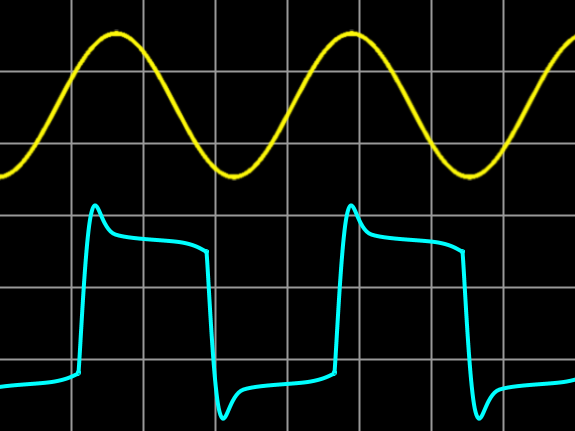
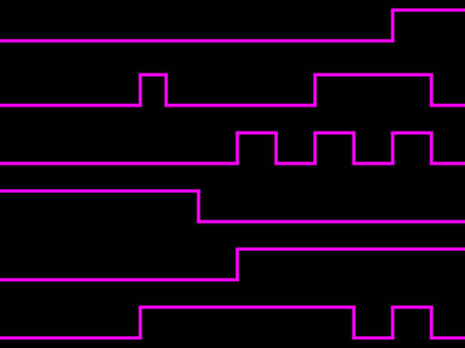

# Logic Analyzer vs. Oscilloscope

## Logic Analyzer vs. Oscilloscope

In the real world, all signals \(including digital ones!\) are analog. An oscilloscope lets us view that analog voltage and how it changes over time. Oscilloscopes are best used for evaluating signal integrity and measuring analog circuit performance.

Logic analyzers, on the other hand, can only represent signals in their digital form: a logic 0 or logic 1. This can be thought of like an oscilloscope with a 1-bit resolution. However, most logic analyzers have many more channels than oscilloscopes \(8, 16, or even over 100 channels\). Along with the ability to configure advanced triggers, logic analyzers are perfect tools for viewing digital waveforms, debugging digital communication \(e.g. Serial, I2C\), and characterizing digital systems with many lines \(e.g. FPGA\).

### Internals of an Oscilloscope

The following diagram shows the basic functional blocks that can be found in a digital storage oscilloscope \(DSO\). Note that the blocks have been simplified.

**Probe:** The part that attaches to your circuit. Most probes have two tips, as an oscilloscope measures the voltage \(electric potential difference\) between two points.

**Amplifier/Attenuator:** Oscilloscopes often contain circuitry to amplify or attenuate electrical signals so they can be effectively displayed to the user. This circuitry can be in the probe or inside the oscilloscope chassis.

**Trigger Select:** Many oscilloscopes will let you chose between an internal signal or an external signal \(on a separate probe\) to trigger the sweep that displays the captured waveform.

**Control Logic:** Internal logic or software that allows users to select features to capture and display signals. This subsystem is also used to control when the ADC captures data points and how information is stored in memory.

**ADC:** Analog-to-Digital Converter. The ADC is in charge of sampling the electrical signal at regular intervals and converting the voltage to digital information that is stored in memory. ADCs for oscilloscopes often have 8, 12, or 16 bits of resolution.

**Memory:** Sampled data from the ADC is stored to memory. This information is used to reconstruct a close approximation of the electrical signal, as a waveform, on the display.

**Time Base:** Used to control the horizontal \(time\) axis on the display. Triggering information can be used to adjust the time base so that a periodic signal, like a sine wave, appears stable in the display.

**Display:** On modern, digital oscilloscopes, the display is computer generated from information in the time base and data in memory. Most often, waveforms as shown with voltage as the Y-axis and time as the X-axis.

### Internals of a Logic Analyzer

The following diagram shows the basic functional blocks in most logic analyzers. Like in the oscilloscope example, the blocks have been simplified.

**Probes:** Fitting many logic analyzer probes into a tight space is often a priority for users. As a result, probes are often simple: a piece of wire with a clip with little or no passive circuitry. Some probes can have dozens of channels packed into a single, high-density connector that requires a specialized mounting point on the system under test.

**Clock Select:** Some logic analyzers will allow you to choose which clock is used to sample the signals. An internal clock will sample at regular intervals \(timing mode\), or an input channel may be used as a clock source \(state mode\).

**Comparator:** Unlike an oscilloscope, the logic analyzer compares each input signal to a user-defined voltage threshold. If the voltage is higher than the threshold, it is stored as a logic high \(1\). Otherwise, it is stored as a logic low \(0\). Because logic analyzers do not require ADCs, they often have many more channels than oscilloscopes.

**Trigger Logic:** Logic analyzers often have more triggering features than oscilloscopes. Any or all of the probed channels can be used to trigger the start of a capture, and some advanced logic analyzers will let you construct a series of if-then-else statements to create complex triggers.

**Trigger Select:** Some logic analyzers will allow you to select between triggering from the captured channels or a separate "trigger" input. This specialized input can be useful for synchronizing to other test equipment, such as an oscilloscope.

**Memory:** Much like many modern oscilloscopes, logic analyzers stored the captured series of logic 1s and 0s in memory. Memory can be inside the logic analyzer's chassis or on a computer \(as is the case for USB logic analyzers\).

**Display:** Waveforms depicting the captured digital signals are drawn on a display for the user. Similar to oscilloscopes, the Y-axis for each waveform is voltage. However, the voltage is a 1-bit value: logic high just shows that the captured voltage was over a threshold and logic low shows the voltage was under it. The X-axis is time.

### Uses

Choosing the right tool for the job can be a crucial step when debugging circuits. At its core, an oscilloscope is useful for measuring and visualizing analog signals with 1-4 channels. A logic analyzer is best for digital systems with more than 4 channels.

An oscilloscope can help you visualize analog waveforms and measure various characteristics, like amplitude, ringing, transient signals, phase, unwanted pulses, etc. Even with digital systems, you can more easily measure signal integrity with an oscilloscope.

However, if you need to monitor and debug the output of a digital system or capture digital communication, such as serial and I2C, a logic analyzer is often the better tool. Logic analyzers generally offer more channels than an oscilloscope and can display data in state mode, where one of the channels acts as a clock.

### Differences

The differences between oscilloscopes and logic analyzers can be summarized in the following table.

| Oscilloscope | Logic Analyzer |
| :--- | :--- |
| Measure and display analog signals on a few channels | Measure and display digital signals on many channels |
| Repeatedly store and display small snapshots | Record data before displaying |
| Displays signals in real time | Allows users to navigate potentially long recordings |
| Measure amplitude and timing of a waveform | Measure time between data capture points |
| Offers real-time features, like fast Fourier transform \(FFT\) | Offers features unique to digital systems, like protocol analyzers |
| Simple threshold or pulse-width triggers used to show a steady waveform | Complex triggering system used to capture and filter data |

### Mixed Signal Oscilloscope

Sometimes, you might find yourself in need of both a logic analyzer and an oscilloscope. Many electrical engineers will have both machines on their workbench. However, the combination of logic analyzer and oscilloscope can be found in a piece of equipment called the _Mixed Signal Oscilloscope_ \(MSO\).

 _Image credits: "_ 350 MHz Mixed Signal Oscilloscope HMO3524 by HAMEG Instruments_" by Hameg_ _is licensed under_ [_CC BY SA 3.0_](https://creativecommons.org/licenses/by-sa/3.0/deed.en)_​_

MSOs can capture and display analog as well as digital signals. They often have several oscilloscope channels along with dozens of digital inputs. Additionally, they can be configured with complex triggers based on both analog and digital characteristics.

