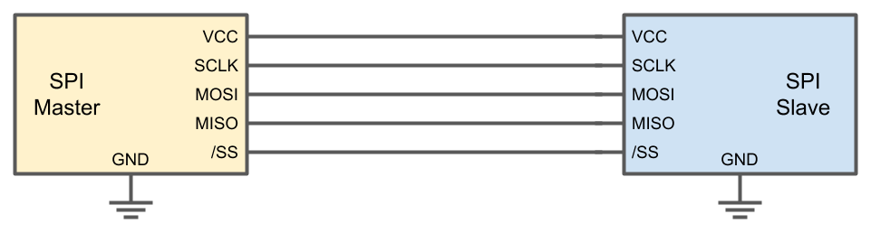
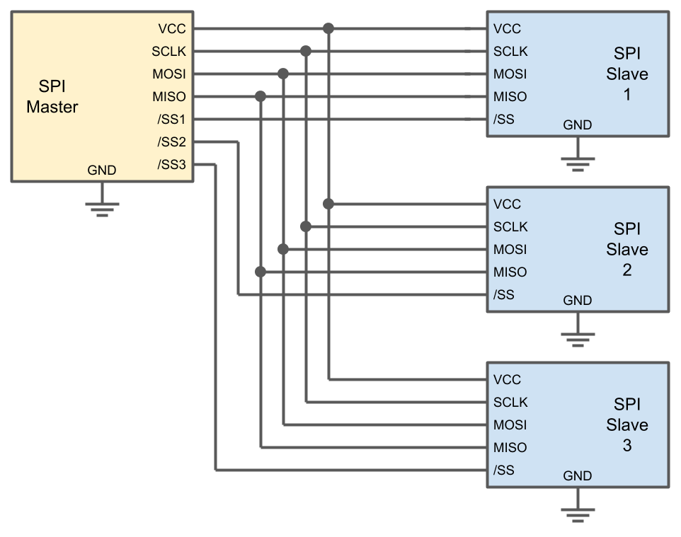
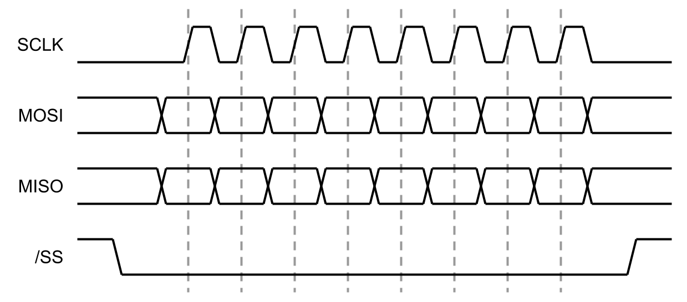
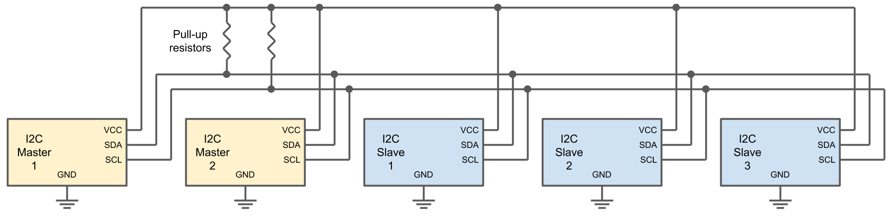

# SPI vs I2C Protocol Differences and Things to Consider

## SPI vs I2C Protocol Differences and Things to Consider

When it comes to communicating between chips on a printed circuit board, two protocols are extremely popular: Serial Peripheral Interface \(SPI\) and Inter-Integrated Circuit \(IIC or I2C\). These wired protocols are considered "little" or "low-end," as they do not have the speed, robustness, and distances boasted by other protocols, such as USB, Ethernet, SATA, etc.

However, SPI and I2C are extremely popular, as they are easy to implement, requiring few components and little code, over their heavyweight cousins. Both rely on serial communication to pass data and support multiple devices on one bus. Many microcontrollers, sensors, and peripherals \(such as LCDs\) rely on SPI and I2C to talk to each other.

If you are designing a product and need to choose between SPI and I2C, which one do you pick?

### SPI

SPI was developed in the 1980s by Motorola as a way to communicate between their early microcontrollers and onboard peripherals, such as EEPROM. Motorola, nor any other organization, maintains any sort of standardization of the SPI protocol. As a result of this "de facto" standard, implementations can vary from manufacturer to manufacturer. Make sure you read the datasheet for each SPI-enabled part very carefully!

SPI uses four active signal lines \(which do not include power and ground lines\) to communicate between parts. These lines include:

* SCLK: Serial Clock \(controlled by master\)
* MOSI: Master Out Slave In \(controlled by master\)
* MISO: Master In Slave Out \(controlled by slave device\)
* SS: Slave Select \(controlled by master\)

With these four lines, a controlling device \(master\) can communicate with another peripheral device \(slave\).

While you may have only one master on the SPI bus, you can add any number of peripherals. However, for each peripheral you add, you must add an additional SS line. In the example diagram, we must use three separate SS lines, each controlling a separate peripheral.

When the master device wishes to send data to or receive date from a peripheral, it starts communication by pulling the corresponding SS line low. At the same time, it activates the clock line \(toggling SCLK high and low at a given frequency\). The master device sends out data on the MOSI line while simultaneously sampling the MISO line. As a result, data can be sent between a master and peripheral device at the same time \(full-duplex\).

Note that only one peripheral device may be communicating at a time with the master.

SPI has four different modes that can be set, which determine how the clock operates. The master and peripheral devices must use the same mode. Mode 0 is by far the most common mode found among devices.

* Mode 0: data sampled on rising clock edge, clock idles low
* Mode 1: data sampled on falling clock edge, clock idles low
* Mode 2: data sampled on falling clock edge, clock idles high
* Mode 3: data sampled on rising clock edge, clock idles high

SPI does not specify any particular voltage levels, maximum speed rates, or addressing schemes. As a result, it is up to you to decide these factors. SPI speeds can easily exceed 10 Mbps, so make sure you read the datasheets for all your parts, as that will determine the acceptable voltages, speed limits, and supported modes.

Because of these speeds, SPI is useful for transferring large amounts of data. SPI is often found on sensors that require fast update rates, like accelerometers, display devices, LCDs, and flash memory devices.

### I2C

Philips Semiconductors \(now known as NXP Semiconductors\) created the I2C specification in 1982 to help standardize communication between chips on the same board. NXP does not charge anyone to use or implement I2C, but they do charge a fee if you would like to register a device address.

I2C uses 2 lines \(not including power and ground\) for communication:

* SDA: Serial Data
* SCL: Serial Clock

Any number of master devices and any number of slave devices can theoretically be attached to the same bus. Both SDA and SCL lines are required to be open-drain lines. As a result, devices can only pull each line low. A pull-up resistor is required on each line to pull the line back up to high.

Because of the open-drain design, I2C supports multiple masters on the same bus. If two devices start transmitting at the same time, one of them will eventually back off in a process known as "arbitration." Devices monitor the SDA line while they communicate. If a device sees that the SDA line is low when it is trying to transmit a logic high, it knows that another device is trying to communicate, and it will stop transmitting.

To begin communication, a master device will issue a START condition, where the SDA line is pulled low while the SCL line is still high. The master then sends out the 7-bit address of the intended recipient on the bus, followed by a write bit \(0\) or read bit \(1\). If a device on the bus has that particular address, it will respond by pulling the SDA line low \(ACK bit\).

Data can then be sent by the master or peripheral device in packets of 1 byte at a time; each byte should be acknowledged by the recipient with an ACK bit. Once communication is complete, the master will issue a STOP condition by releasing the SDA line \(which will be pulled high\) while SCL is high.

Data rate was originally limited to 100 kbps \(standard mode\). In 1992, Philips raised the speed cap to 400 kbps \(fast mode\). A special 3.4 Mbps mode \(high-speed mode\) was added 6 years later. A special set of commands must be given at lower speeds between master and peripheral to set up a high-speed connection.

While any number of devices can be physically attached to an I2C bus, the 7-bit address limits the actual number of devices. Some of the addresses are reserved, and therefore, only 112 different devices can be present on the same bus. A special 10-bit addressing mode can be enabled to allow for more devices, if necessary.

I2C has a form of flow control known as "clock stretching." A peripheral device can hold the SCL line low, which tells the master device to slow the transmission rate. This technique allows the peripheral some time to process data before responding.

Due to the low pin count required by I2C, many sensor manufacturers use this protocol in their chips. For example, temperature sensors, accelerometers, analog-to-digital converters, etc. can be found with I2C.

### Comparison

|  | SPI | I2C |
| :--- | :--- | :--- |
| Pin drive | Push-pull | Open drain |
| Signal lines | 4 \(plus 1 for each additional peripheral\) | 2 |
| Max speed | No limit \(10-100 Mbps is common\) | 400 kbps in fast mode \(3.4 Mbps is possible with high-speed mode\) |
| No. of peripherals | Only limited by number of pins available for SS lines on master | 112 with 7-bit addressing |
| Multi-master | No | Yes |
| Flow control | No | Yes |

### Conclusion

Both protocols are suitable for many different applications. Most often, you are limited to whichever protocol is implemented by the manufacturer of a particular part. Some, like the Analog Devices ADXL345 accelerometer offer both I2C and SPI interfaces on the same chip.

If you have to choose between the two, SPI is generally the better tool if you need faster transfer speeds. I2C, on the other hand, is best if you have limited pins available on your microcontroller or microprocessor.

