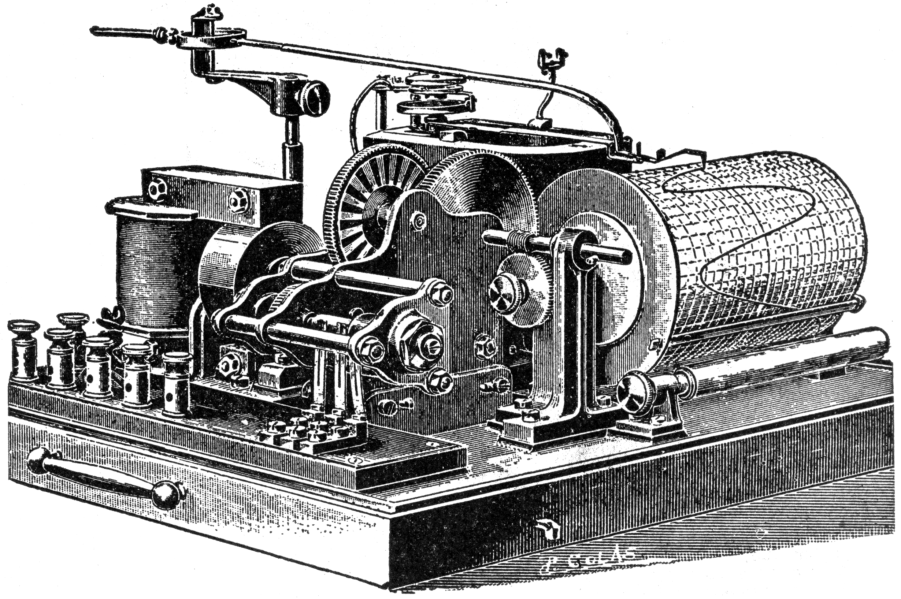
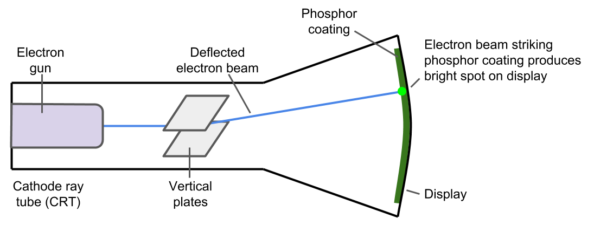
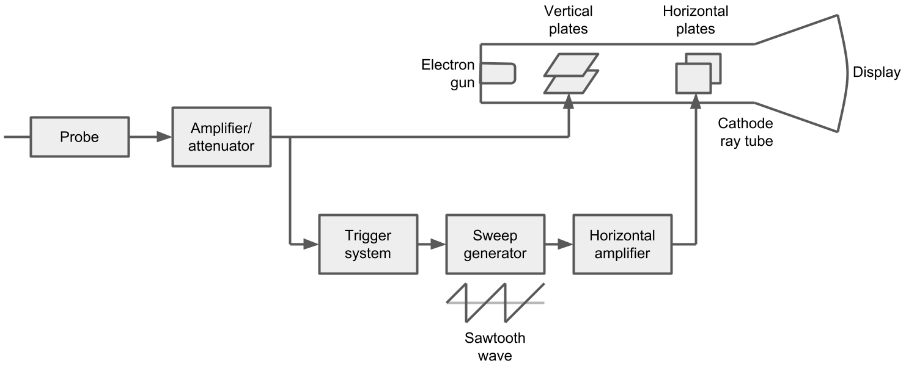
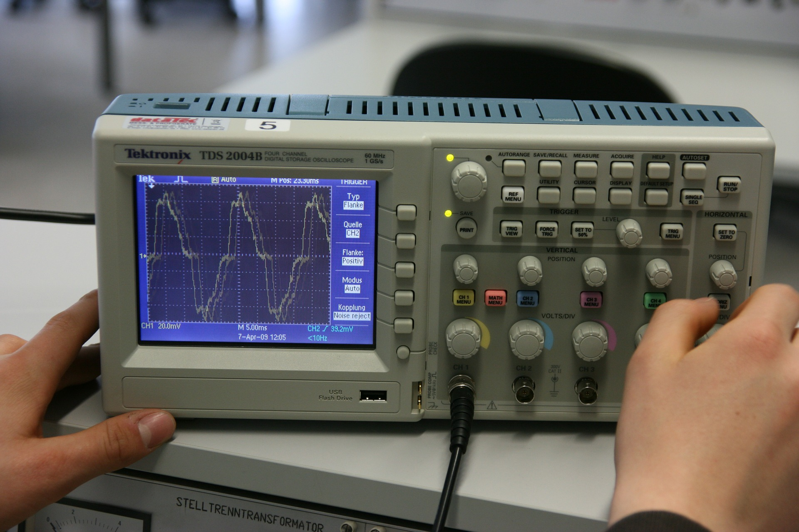

# How Does an Oscilloscope Work?

## How Does an Oscilloscope Work?

### Overview of Oscilloscopes

At its core, an oscilloscope allows you to watch how the voltage between two points in a circuit varies over time. For example, if you were to probe a sinusoidal voltage, your oscilloscope might display something similar to Figure 2.

By looking at such waveforms, you can get an idea of how a circuit is operating. This can help you identify potential problems with the circuit, characterize its operation, or view signal integrity over a transmission line. This article can help you understand more about the basics of an oscilloscope: [What is an Oscilloscope?](what-is-an-oscilloscope.md)

The most popular modern oscilloscope is the digital storage oscilloscope \(DSO\). Before we examine how a DSO works, let's take a look at its humble beginnings.

### Analog Oscilloscope

One of the first attempts at automating the system of converting electrical signals to a display was the  Hospitalier Ondograph in the early 1900s. This device, shown in Figure 3, relied on discharging a capacitor into a galvanometer, which had a pen attached to the end. As the voltage varied, the pen would move back and forth, drawing a waveform on a scrolling piece of paper.

Unfortunately, most electrical signals varied too quickly for the ondograph's mechanical system. As a result, a signal needed to be sampled multiple times to be drawn on the paper accurately.

In the late 1800s, scientists discovered that sub-atomic particles \(now known as electrons\) would travel in straight lines from the cathode end of a [Crookes tube](https://en.wikipedia.org/wiki/Crookes_tube). As a result, scientists dubbed these particles "cathode rays." In the subsequent years, other scientists discovered that these rays could be bent by applying an electric field or a magnetic field.

In 1897, Karl Ferdinand Braun, German physicist and inventor, built the first oscilloscope cathode ray tube \(CRT\) by applying a voltage to vertical plates over and under the electron beam. The electron beam would strike a phosphor plate on the opposite end and paint a bright dot. As the voltage varied across the plates, the dot would dance up and down, as shown in Figure 4.

Jonathan Zenneck, physicist and electrical engineer from the Kingdom of Württemberg \(now part of Germany\), added a set of horizontal plates to the CRT in 1899, which allowed the electron beam to sweep back and forth across the screen. With the ability to control the vertical and horizontal motion, we can now construct a graph of an electrical signal on a screen in real time.

The following video shows how an analog oscilloscope can be used to measure voltages in a circuit:



Now that we've seen how analog oscilloscopes came into being, lets break down their operation. Figure 5 shows the internals of such a scope \(in block diagram form\) along with descriptions of each of the components.

**Probe:** The piece that connects to your circuit under test. Most probes have two tips, as oscilloscopes measure the electric potential difference \(voltage\) between two points.

**Amplifier/Attenuator:** Often, an electrical signal needs to be amplified \(increase the amplitude\) or attenuated \(decrease the amplitude\) to be effectively displayed to the user or to not damage the internal circuitry of the oscilloscope.

**Trigger System:** A trigger is a user-defined condition \(such as a voltage threshold\) that determines when the oscilloscope should begin drawing a waveform. This can be extremely helpful in finding sporadic pulses in a circuit or synchronizing the display to a repeating pattern, like a sine wave, so that it appears steady on the screen.

**Sweep Generator:** To control the horizontal plates in the CRT, the sweep generator creates a repeating sawtooth voltage pattern. This causes the beam to sweep from one side to the other in the CRT. The frequency and triggering of the sweep generator is set by the user.

**Horizontal Amplifier:** Much like the amplifier found after the probe, the horizontal amplifier increases the amplitude of the sawtooth wave from the sweep generator so that it can control the horizontal plates in the CRT.

**CRT:** An electron gun fires a steady stream of electrons onto a phosphor-coated screen, which produces a bright dot. Two sets of plates control the deflection of the beam. The vertical plates are directly controlled by the voltage seen on the probe, and the horizontal plates are controlled by the sweep generator. As the deflection of the beam changes rapidly, a solid line appears on the screen. This line on the display represents the voltage \(as seen on the probe\) as it varies over time.

### Digital Oscilloscope

In the 1980s, the company Nicolet Test Instrument created the first digital storage oscilloscope \(DSO\) using a relatively slow \(1 MHz\) analog-to-digital converter \(ADC\). As digital technology became more advanced, digital oscilloscopes became faster, smaller, and more popular.

Modern DSOs are essentially computers with high-end ADCs used to sample voltages. However, many of the functions and the interface are the same as those found on older analog oscilloscopes, as can be seen in figure 6.

Figure 7 shows the internal workings of a digital storage oscilloscopes.

**Probe:** The oscilloscope needs a way to measure the voltage between two points in your circuit under test. Most probes have two tips that you attach to different nodes in your circuit.

**Amplifier/Attenuator:** Most oscilloscopes have circuits that amplify or attenuate captured electrical signals so they can be effectively displayed to the user and to avoid damaging components inside the oscilloscope.

**Trigger Select:** Many modern oscilloscopes allow you to chose between an internal or external signal \(from a separate source\) to trigger the display of the waveform.

**Control Logic:** Logic or software that allows a user to configure how signals are captured and displayed. The control logic is similar to the horizontal controls found on the analog oscilloscope but often offers more options.

**ADC:** The analog-to-digital converter samples the electrical signal from the test circuit at regular intervals as set by the control logic. These samples are converted to binary numbers that are stored in memory.

**Memory:** Digital information representing the sampled signal is stored in memory. This information is used to reconstruct a close approximation to the original electrical signal on the display in graph format.

**Time Base:** As set by the control logic, the time base controls the horizontal axis on the display. The user can set one or more trigger points to adjust the time base to capture sporadic signals or hold periodic signals, like sine waves, steady in the display.

**Display:** The oscilloscope takes data from memory, combines it with information from the time base, and displays a waveform on the screen. Often, this waveform will be a close representation of the originally sampled signal with voltage as the Y-axis and time as the X-axis. Some older digital oscilloscopes use CRTs as displays whereas most modern DSOs rely on LCDs.

### The Evolution of Oscilloscopes

Ever since their invention, oscilloscopes have evolved into smarter and more powerful pieces of test equipment. PC-based oscilloscopes are highly portable and use a computer's processing power to analyze and display waveforms. Digital phosphor oscilloscopes \(DPOs\) add features that mimic analog oscilloscope's abilities to display a signal's frequency-of-occurrence.

Oscilloscopes paved the way for [logic analyzers](../logic-analyzers/what-is-a-logic-analyzer.md), which specialize in displaying digital signals. Eventually, these two powerful pieces of equipment would be combined into the mixed signals oscilloscope \(MSO\). MSOs are capable of displaying analog signals just as well as an oscilloscope while analyzing digital signals like a logic analyzer.

