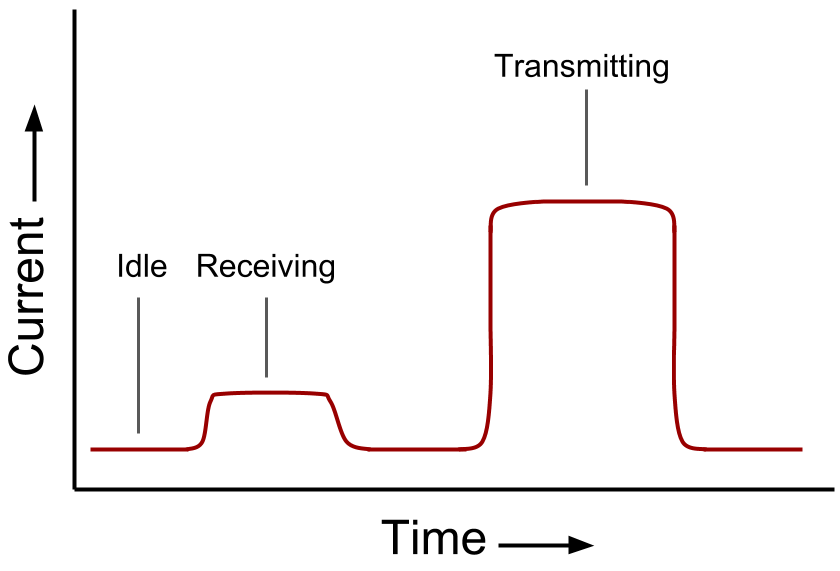
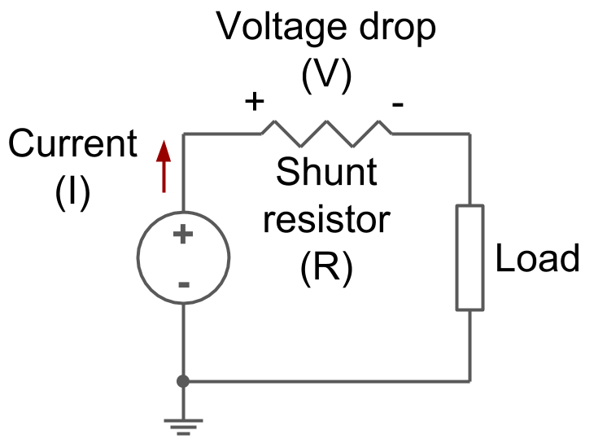
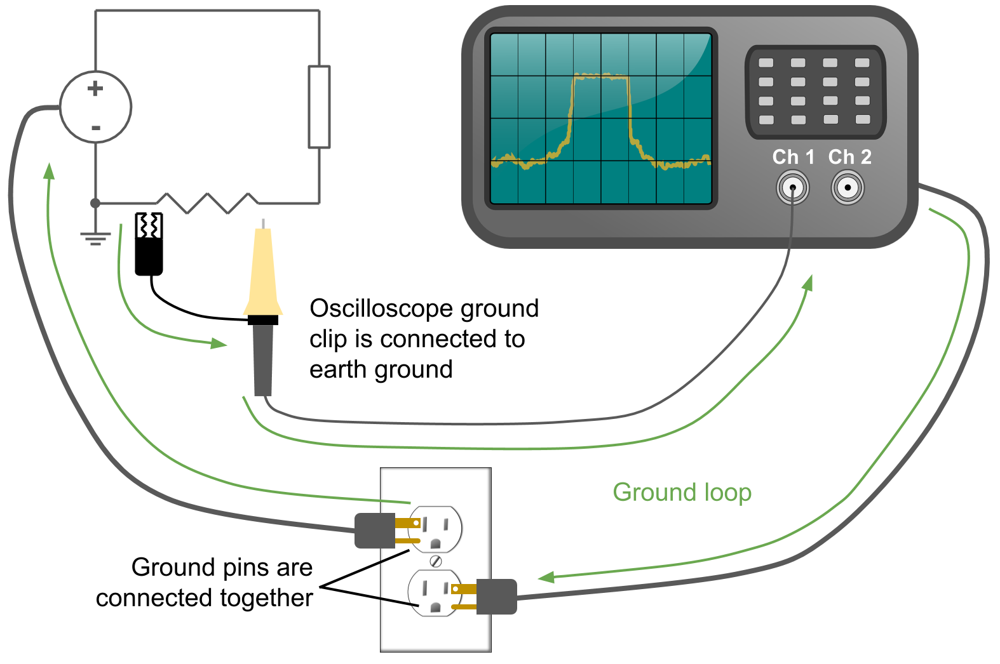
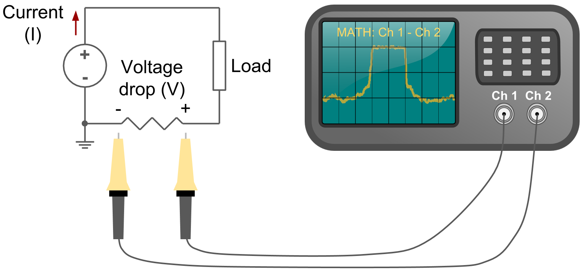

# How to Measure Current with an Oscilloscope

## How to Measure Current with an Oscilloscope

### The Problem with Oscilloscopes

An oscilloscope allows you to look at how the voltage between two points varies over time. By plotting this voltage with respect to time, you end up with a graphical representation of your signal. If you would like to learn more about how oscilloscopes perform this function, we recommend checking out this [article first](what-is-an-oscilloscope.md).

An electrical engineer's first measurement tool is often a multimeter, which is capable of measuring several things, such as voltage, current, and resistance. A multimeter generally shows an average over time, and as a result, cannot display rapidly changing pulses or repeating signals. This is where an oscilloscope comes in handy.

On the other hand, many multimeters are capable of measuring current, which is something an oscilloscope cannot do. So, how do we measure current for a system that rapidly changes? First of all, why would we want to do this?

### Example Circuit

Let's say that you are building the next smartphone, and you want to figure out how long the battery will last. Smartphones are capable of turning on and off features only when needed, such as transmitting to a cell tower at specific intervals. If you were to measure the current flowing from the battery to the rest of the phone, you would see current that changes rapidly all the time. You would not be able to get a consistent reading!

This is where an oscilloscope can help. If you were able to measure current consumption as it changes with time, you might get a graph like in figure 1. As a result, you could begin to calculate how long your battery would last.

Measuring current draw in real time \(as opposed to an average\) can help you characterize your device's power usage or debug potential problems. For example, your processor may draw a large amount of current at startup, and you would need an oscilloscope to see that surge.

### Measuring Current

The easiest and most common method of measuring total current flowing into a load is to use a shunt resistor. This is accomplished by placing a low-value resistor inline with the power \(or return line\).

In this case, your load would be your circuit under test \(such as your smartphone\). The power supply would be something like your battery or wall adapter.

If you measure the voltage across the resistor, then you could use Ohm's Law to calculate the current flowing into your load:

$$
V=I\times R
$$

We simply rearrange the formula to solve for current:

$$
I= \frac{V}{R}
$$

If we know the resistance and measure the voltage drop across the resistor, we can calculate the current flowing through the resistor, which is the same as the current flowing into the rest of the circuit and that moment.

For example, let's say that we have a 0.1 Ω shunt resistor and we measure a 0.03 V drop across it using our multimeter:

$$
I= \frac{0.03 V}{0.1  \Omega } =0.3 A
$$

We would determine that at that particular moment, 0.3 A was flowing from our power supply into our load.

Shunt resistors \(Rsh\) are often kept to low resistance values so as not to induce a voltage drop in the circuit. Remember, as the current draw into your load increases, the voltage drop across the shunt resistor also increases. This could result in a voltage drop large enough to power down your whole system!

Common values for Rsh are in the 0.01 to 0.1 Ω range. Using higher values of Rsh offers more accuracy of your measurement but at the cost of increased voltage drop in the power rail to your load.

### Power Limitations

The other thing you must keep in mind is the power dissipation of your shunt resistor. For most low-power systems, a 1/4 W resistor will suffice. As you start drawing more current, the resistor will begin to dissipate more power as heat, which could damage the resistor \(resulting in failure or worse, fire\).

DC power is calculated as:

$$
P=V \times I
$$

This can be used as a worst-case calculation for how much power you expect Rsh to dissipate. Form our previous example, we can see that:

$$
P = 0.03 V \times 0.3 A = 0.009 W
$$

Even a tiny 1/10 W or 1/8 W resistor would be capable of acting as a shunt resistor in this case. However, let's say that our circuit suddenly turns on a DC motor, and the voltage drop across Rsh increases to 0.5 V. We would calculate the current as:

$$
I = \frac{0.5 V}{0.1 \Omega } = 5 A
$$

We now have 5 A flowing through our circuit! That's quite a large increase from before. Now we calculate the expected power dissipation through our resistor:

$$
P=0.5 V \times 5 A = 2.5 W
$$

We're now expecting the shunt resistor to dissipate 2.5 W of power. That would be far too much for most basic 1/4 W resistors. At this point, you should look at using a 3+ W power resistor or switching to a lower value for Rsh.

The lesson is this: choose the value of your shunt resistor based on the expected current draw of your circuit. It doesn't cost much to perform a few quick calculations to save the headache of damage to your circuit later!

### Oscilloscope Setup

Now that we've seen how to select a value of Rsh and measure current flowing through it, let's take a  look at how we might configure our oscilloscope to measure current. At first glance, our original schematic \(Figure 2\) might look like it would work well. Using the resistor on the positive rail is known as a _high-side_ shunt resistor. There is a slight problem with that, however: the ground clip on most desktop oscilloscopes is directly connected to earth ground! 

This video provides a great overview of how an oscilloscope ground clip might short out a power supply on your circuit:



If we are working with a circuit that is grounded and a desktop oscilloscope \(that is also properly grounded\), then connecting the ground clip to either side of Rsh would result in a short. Not good.

One option is to move the resistor to the return path \(known as a _low-side_ shunt resistor\) and connect the oscilloscope's ground clip to the circuit's ground.

You will not have to worry about shorting out your power supply with this setup. However, you introduce a new problem: a ground loop. Current can circulate around the ground loop \(from earth ground, through our circuit under test, through the oscilloscope ground clip, back to ground through the oscilloscope\).

Ground loops can cause unwanted interference or noise to appear on your measurements or in your circuit. [This article does a great job at explaining ground loops](https://hackaday.com/2017/03/09/wtf-are-ground-loops/). Note that this is only a real problem if both your oscilloscope and circuit under test are both connected to earth ground, as shown in figure 4.

If your oscilloscope or device under test is battery-powered or isolated from earth ground, you do not need to worry about this issue. However, to be extra safe, the best way to measure the voltage drop across a shunt resistor is to use a two-probe setup configured as a differential pair.

### Differential Probe Setup

You will need 2 channels on your oscilloscope to perform this measurement. Most oscilloscopes have their ground clips connected together \(you can confirm this with a multimeter if you are unsure\). As a result, we do not need to connect the ground clips to anything.

Connect your probe tips to either side of the shunt resistor. For this example, we assume that channel 1 is at a higher potential than channel 2. While Figure 5 shows a low-side shunt resistor, note that you can do this with a high-side resistor as well.

On your oscilloscope, select the _Math_ function \(assuming your oscilloscope has such a function\). From there, you should be able to plot the output of _Ch 1 - Ch 2_. By subtracting the channel 2 voltage from the channel 1 voltage, we can compute the voltage drop across the resistor without worrying about shorting our power supply or creating a ground loop!

Remember that for every point on this waveform, you will need to divide the voltage by the value of the shunt resistor to get the current flowing into your system. Some oscilloscopes allow you to divide the measured value by a constant to save you from needing to perform this step. Check the _Math_ functions in your oscilloscope!

### Other Options for Measuring Current

If your oscilloscope is battery powered or your device under test is isolated from Earth ground \(for example, it is also battery powered or you are using a two-pronged wall adapter\), then you do not have to worry about shorting your power supply to ground. Feel free to attach that ground clip to either side of your shunt resistor!

You can also purchase a specialized _differential probe_ for your oscilloscope that accomplishes the same differential setup we discussed above. However, a differential probe requires only 1 channel instead of 2. Additionally, differential probes can be quite pricey.

Another option is an oscilloscope current probe. Most current probes clamp around an exposed wire and measure the magnetic field generated by the current flowing through the wire. This requires an exposed wire in your circuit, and clamp-style probes are generally only accurate down to the milliamp level. A shunt resistor is generally needed to measure microamps and nanoamps

A fourth option is to use a specialized circuit or part for measuring voltage across a shunt resistor, such as an INA169. The INA169 essentially creates a differential probe around the shunt resistor and produces an output voltage that you can measure on a scope. However, note that the INA169 is only capable of measuring positive voltages \(high-side shunt resistor\). Make sure you fully read the datasheet to understand the part's limitations!

There are many options for measuring current flowing through your circuit. We recommend taking some time to understand how you can take such measurements and the limitations of each approach.

