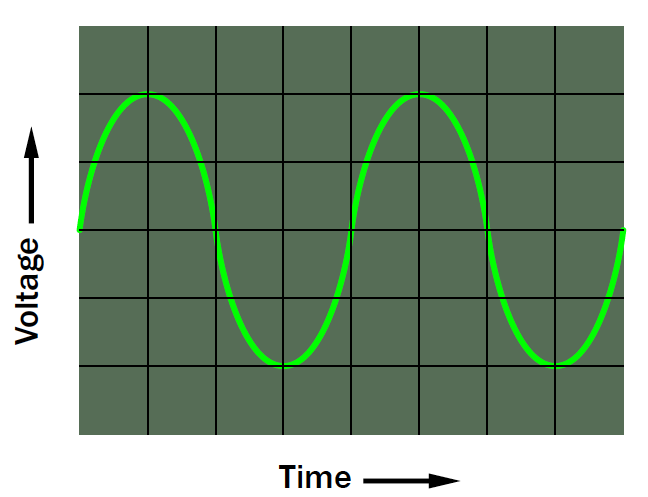
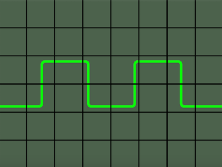
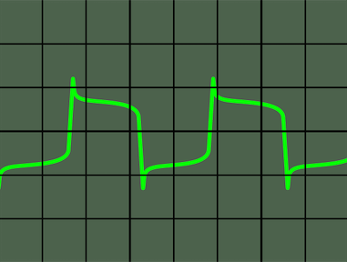

# What is an Oscilloscope?

## What is an Oscilloscope?

### Oscilloscope Fundamentals

Building or troubleshooting a circuit would be so much easier if you could actually see electrons flowing through the wires. Since that isn't possible, you need tools to show you what's happening.

The most basic tool is a meter, but that cannot display rapid fluctuations in voltage. At best, it can only give you an approximate average value.

If you want to see and measure a spike in voltage, or the shape of an audio waveform, or the tiny burst of electrical noise caused by the opening and closing of contacts in a switch, you need an oscilloscope. This is often referred to simply as a "scope".

An oscilloscope is equipped with a probe that you touch to a location of interest in a functioning circuit. The voltage detected by the probe is then shown graphically on a screen, in an image known as a trace. An example is shown in Figure 1, where the trace is of a sine wave derived from an audio signal. The grid superimposed on the trace helps you to make approximate measurements.

Suppose you have a chip such as a 555 timer, which creates square-wave oscillations. Ideally the output should be a nice, clean trace such as the one in Figure 2, but in the real world the output may be more like Figure 3. The transient voltage spikes can cause problems elsewhere in a circuit, especially if they enter the power bus. If you add a capacitor between the positive supply pin of the chip and negative ground, this may help to suppress transients. But which value of capacitor will do the job most effectively? An oscilloscope can answer that question.

### History

Old-school oscilloscopes displayed their output on a monochrome cathode-ray tube \(CRT\) in which an electron beam drew glowing images on the phosphor coating inside the screen. This was like a 1950s television set, except that the oscilloscope trace was usually green. An old scope such as the one shown in Figure 4 was large, heavy, and expensive. This type of unit is now referred to as an analog scope.

When digital oscilloscopes were introduced, they became known as storage oscilloscopes because their internal memory could store the signal being displayed. This was facilitated using an internal analog-digital converter \(ADC\) which sampled the analog input voltage and converted it to a stream of digital values. Storage oscilloscopes are equipped with LCD screens instead of CRTs.

A handheld storage oscilloscope is shown in Figure 5. Some units have touch-screen controls instead of physical knobs and buttons.

_Image credits: Figure 5, Copyright-free,_ [_Adafruit Industries_](https://www.adafruit.com)\_\_

A third generation of scopes was developed for use with desktop or laptop computers. Known as USB oscilloscopes, they consist of just a small box that digitizes signals from a circuit and outputs the data through a USB port to the computer. After software conversion, the trace is displayed on the computer screen.

A USB oscilloscope can be extremely affordable. It also enables very easy screen capture, as a trace may be copy-pasted straight into a document.

### Features

Any oscilloscope will have basic controls to adjust time/div \(the time per horizontal division on the screen\) and volts/div \(the voltage per vertical division on the screen\). Volts/div is a function of gain--the amplification of the input voltage. Additional controls allow you to adjust the horizontal and vertical position of the trace, to center it on the display.

Many oscilloscopes enable a split screen to display and compare two signals. Also, any oscilloscope that uses a backlit color LCD display, or can send its signal to your computer, will add color to make the data easier to read.

The specification for an oscilloscope should include terms such as the bandwidth \(the range of frequencies that the oscilloscope can display\), the rise time \(the duration of the most rapid signal rise that can be resolved\), and in a digital oscilloscope, the sampling rate \(which should be about 10 times the maximum frequency to be measured\).

### Do You Need an Oscilloscope?

If you only deal with steady DC voltages, and you never use components that are noise-sensitive or do rapid switching, you may not need to see small fluctuations in voltage. However, an oscilloscope can be indispensable if you want to build, repair, or investigate circuits such as:

* Any kind of amplifier, especially an audio amplifier, where the shape of the output waveform should match the shape of the input, and you may want to see the effect of tone controls or filters.
* Circuits that contain logic chips which switch rapidly and are susceptible to voltage spikes--or may create spikes of their own.
* An AC-DC converter where the DC output should be as smooth as possible.
* A DC-AC inverter where the AC output should be as close to a sinewave as possible.
* Switches or relays which you need to debounce, to clean the signal.
* Any type of analog sensor creating an output that you need to inspect.
* You may also use an oscilloscope to view rapid events in the real world such as sounds or mechanical vibrations, which you can convert into electronic signals for the scope to display.
* Since oscilloscopes have become so affordable, they can be standard equipment not only for engineers but for hobbyists who want to see exactly what's going on inside electronic circuits.

