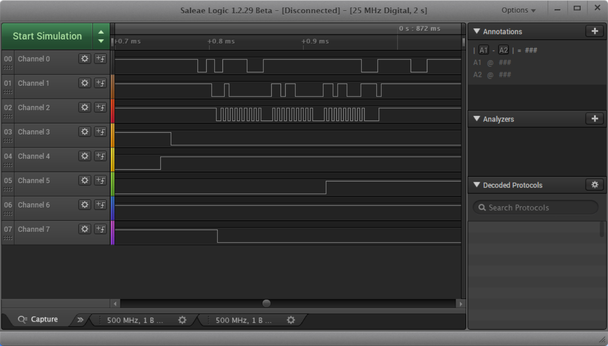
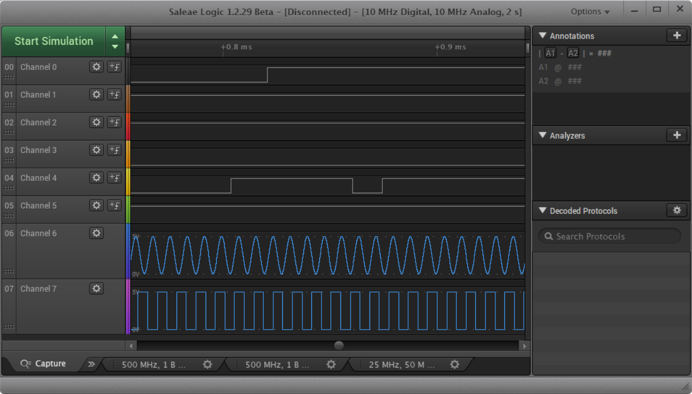
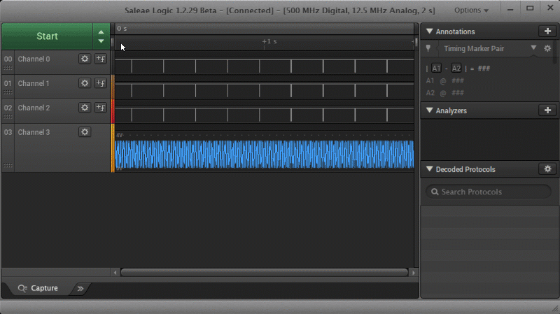
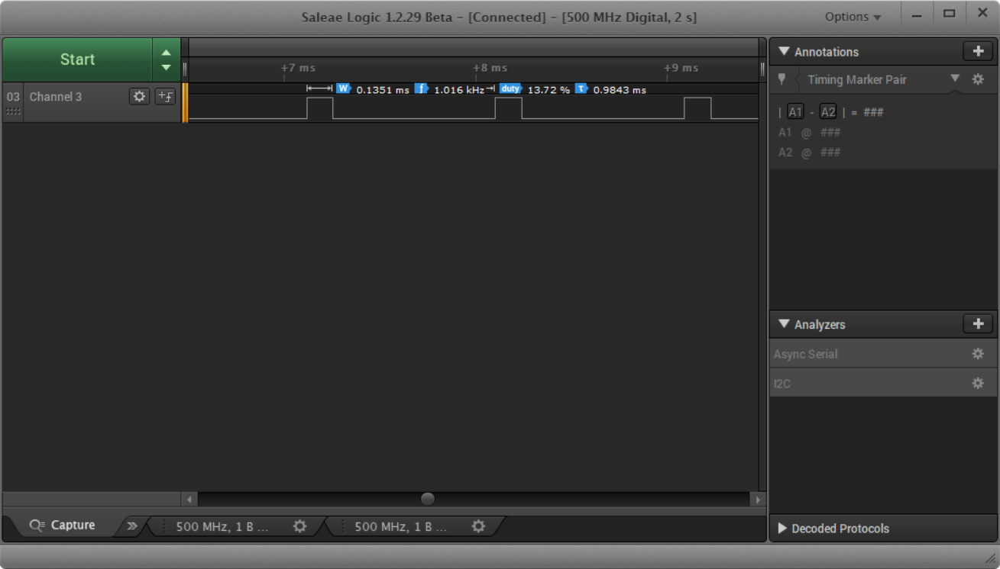
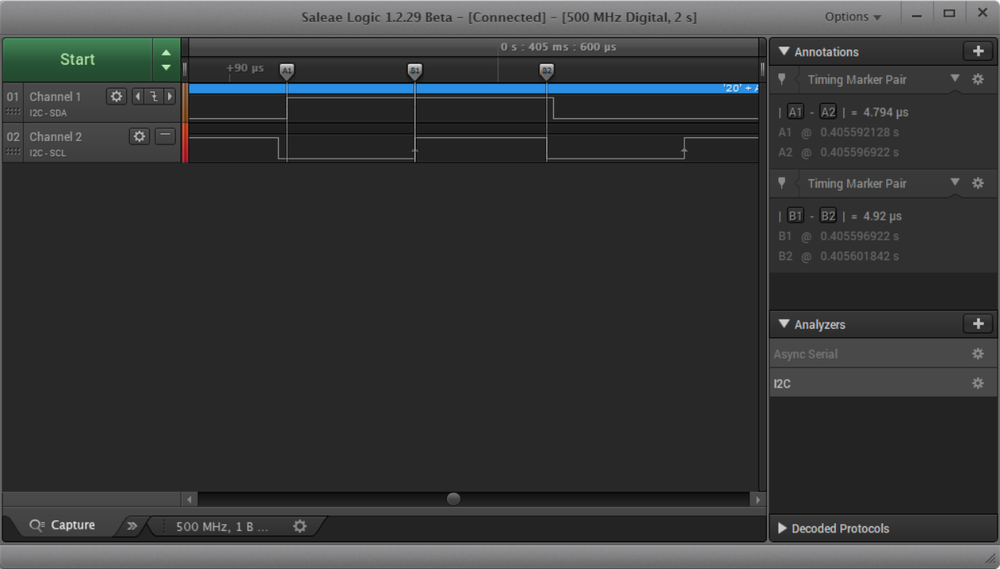
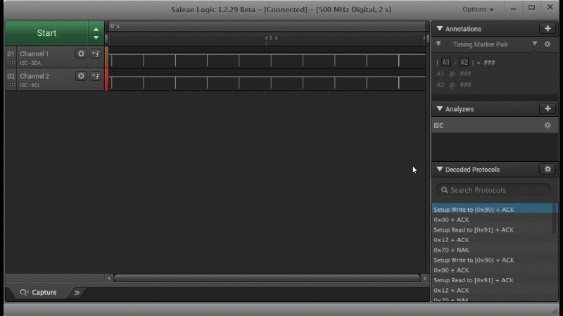
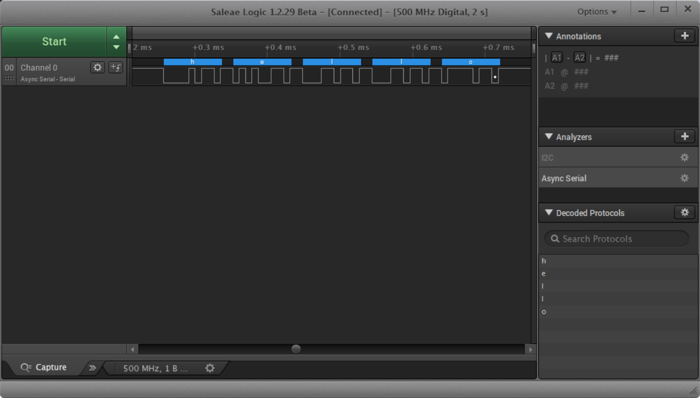

# What Is a Logic Analyzer?

## What Is a Logic Analyzer?

A logic analyzer is an instrument for capturing, displaying, and measuring multiple electronic signals simultaneously in a digital circuit. Logic analyzers are capable of showing the relationship and timing among many different signals in a digital system and are often capable of analyzing digital communication protocols, such as I2C, SPI, and Serial. As a result, a logic analyzer is the best tool for debugging digital circuits and digital communication systems.

### Filling a Need

The 1960s saw the rise of the integrated circuit \(IC\), which meant that circuits started to become smaller. In turn, thousands--eventually millions--of transistors could be packed into a single chip to perform complex digital logic operations, forming the basis for most microcontrollers, microprocessors, and field-programmable gate arrays \(FPGAs\) that we know today.

As transistor count and pin count grew on these ICs, testing and characterizing them became increasingly difficult. Oscilloscopes have been around since the 1930s, and while they are often considered the de facto test equipment for many electrical engineers, adding more than a handful of channels to an oscilloscope proved extremely costly.

In 1973, Hewlett Packard announced the invention of the first "Logic Anaylzer" that could measure and display digital logic across a set of LEDs. The HP 5000A was the first commercially available logic analyzer, but ut was limited to only two channels. In the years to come, commercial logic analyzers began boasting dozens of channels that could read and display digital logic in parallel.

Image credits: "[Tektronix Logic Analyzer TLA5204](https://commons.wikimedia.org/wiki/File:Tektronix_LogicAnalyzer_TLA5204.jpg)" by [Vonvon](https://commons.wikimedia.org/wiki/User:Vonvon) is licensed under [CC BY 3.0](https://creativecommons.org/licenses/by-sa/3.0/deed.en)

The oscilloscope is still the perfect tool for analyzing how analog voltages between two points varies over time on up to 4 channels \(some oscilloscopes offer more channels, but 2-4 channels are the most common\). Even for digital systems, an oscilloscope can be great for measuring things like rise and fall times, ringing, power consumption, jitter, and propagation delays. If you require a higher channel count to trace and correlate multiple digital signals simultaneously, a logic analyzer is the right tool for the job.

### What Makes a Logic Analyzer Unique

The biggest advantage of a logic analyzer is its ability to record one or more digital signals simultaneously.  While a multi-channel oscilloscope could accomplish the same feat, logic analyzers generally offer more channels at a lower price. Number of channels usually range anywhere from 8 to over 100. 

Similar to oscilloscopes, logic analyzers can be configured to begin recording on a trigger condition. Triggers can be as simple as a single rising or falling edge of a particular channel, or they can be a complicated set of conditions that include edges or states of multiple channels.

Many modern logic analyzers include some oscilloscope functionality and vice versa. These new tools, capable of recording and analyzing digital as well as analog signals, are known as _mixed-signal oscilloscopes_. Test equipment that can serve multiple purposes can make characterizing complex circuits and systems easier.

Many standalone logic analyzers include screens capable of displaying the captured signal data. However, as personal computers become more powerful with faster peripheral ports \(for example, USB 3.0\), some logic analyzers forgo the screen and rely on computer software to perform the analysis. This saves on equipment size and costs.

Most logic analyzers work by capturing data, storing it in a buffer, and then displaying it on a screen. Some are capable of showing signals in real-time, much like an oscilloscope. While this can be useful to look for trends while a system is running, it can be tough to search through and look for details in the signals.

Logic analyzers, whether standalone or attached to a computer, usually include software or controls for navigating through large amounts of signal data. This can include zooming, panning, searching, etc.

Modern logic analyzers and logic analyzer software contain many advanced features that can help users characterize signals. This includes measuring aspects of the signal, such as pulse width, frequency and period of periodic signals, as well as duty cycle.

If you are analyzing transmission data between two systems, a logic analyzer can be an invaluable tool for measuring timing events. For example, with I2C, the data line \(SDA\) needs to be held at its intended value for a particular amount of time \(part dependent\) before the rising edge of the clock line \(SCL\). This is known as _setup_ time. For most implementations of I2C, SDA also needs to be held at its intended value until the subsequent falling edge of SCL. This is known as _hold_ time.

A logic analyzer with a fast enough sampling rate can help measure setup and hold times.

With recorded data, many logic analyzers will allow you to search through the data looking for particular patterns. For instance, in our I2C example, we can look for the device's bus address, as that will denote the beginning of a transmission. Some logic analyzers will let you set a search pattern as the trigger to begin recording.

Another unique feature of logic analyzers is the ability to decode signals. Most modern digital communication is implemented based on a set of protocols. Logic analyzers or their associated software can include these protocols, known as _protocol analyzers_, to help you make sense of the captured data. Some of the popular protocols include:

* SPI
* I2C
* Serial \(UART/USART\)
* 1-Wire
* CAN
* UNI/O
* I2S/PCM
* MP Mode
* Manchester
* Modbus
* DMX-512
* Parallel
* JTAG
* LIN
* HDLC
* HDMI CEC
* PS/2
* USB

### Form Factors

Portable logic analyzer \(instrument chassis\) Modular logic analyzer \(modules that plug into a mainframe\) PC-based logic analyzer \(standalone units that plug into a computer via USB, Ethernet, etc.\)

### How a Logic Analyzer Works

Input is digitized: thresholds for TTL, CMOS, user-defined. 0 for low, 1 for high.

Sync \(state\) vs async \(timing\) clocking

All channels are sampled simultaneously and stored in memory

When trigger condition is met, contents in memory are displayed. Triggers can be user pushing button, single channel transition, several channel states, pattern in one or more channels.

Various tools can help the user browse through the data, search for patters, and analyze protocols.

### Why Would You Need a Logic Analyzer?

What kinds of problems can LAs help you solve?

Measure the time between events.

Debug protocols such as UART, SPI, I2C, etc.

Test and characterize firmware \(toggle GPIO at the beginning and end of events\)--interrupts, sleep, power

Reverse engineer undocumented digital hardware

